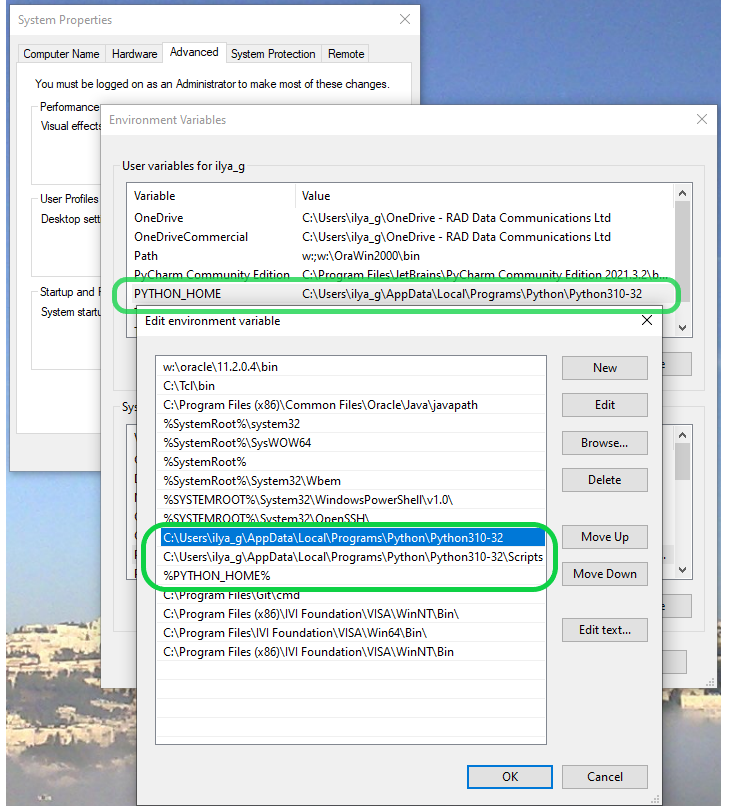

# Software description

##	Installs
* Windows 10/11  
* TeraTerminal
* The Tester local Net’s Interface should have IPv4 169.254.1.10, and it’s name should be “SSH net”
* TesterWin10_2.6_miniPC (TclTk8.6,  RLSerial, RLCom, RLUsbPio, RLUsbMmux, RLTime, RLStatus, RLSound, Plink)
* Java 1.8.0_191, RAD Oracle Local Client
* Python 3.9  
	
	
## AT software package
C:\AT-SF1P\software

## Operation files
- 1-Tester.tcl
- 2-Tester.tcl

## Description
The Tester performs tests of the SF-1P.  
The 6 EthPorts (SFP Port and the UTP Ports) are checking by 2 EtxGeneraors.  
The HW definitions – COM and PIO ports – are defined in HWinit.tcl file, which located at folder C:\ AT-SF1P\software \[PC name]. The `[PC name]` is defined by `[info host]`.  
Programmable Power Supply IT6933A used to perform Voltage Test. Its drive (ni-visa_24.0_online.exe) is located at [TDS](files://prod-svm1/Tds/Install/ATEinstall/IT6900_driver).  

